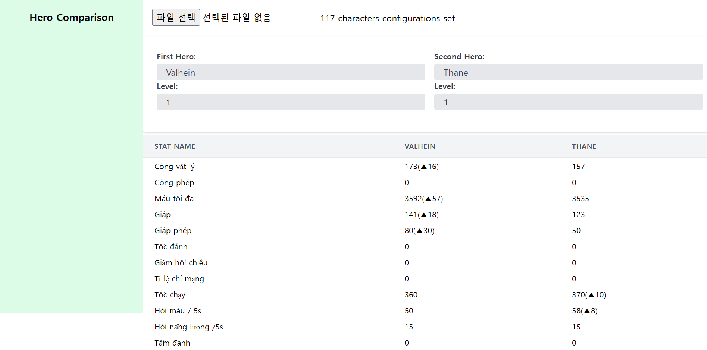

# Liên Quân Mobile Dashboard

This dashboard is designed to enable strategic play in Liên Quân Mobile by visualizing data. It allows for the comparison of heroes' stats, providing insights that can help in making informed decisions during gameplay.

## Features

- **Hero Comparison:** Compare the stats of different heroes to understand their strengths and weaknesses.

## Getting Started

To use the dashboard, you need to import hero stats data. This data is available in an Excel file that can be generated by running a specific GitHub repository.

### Step 1: Generate Hero Stats Excel File

1. Visit the GitHub repository at [https://github.com/lien-quan/hero-stat-list](https://github.com/lien-quan/hero-stat-list).
2. Follow the instructions in the repository to run the code, which will generate an Excel file containing the stats of Liên Quân Mobile heroes.

### Step 2: Import Excel File into Dashboard

Once you have the Excel file, import it into the dashboard to start comparing heroes' stats.

## Dashboard Preview

## Usage

After importing the data, you can:

- Select heroes to compare their stats.
- View detailed comparisons to make strategic decisions for your gameplay.

## Contributing

Contributions are welcome! If you have suggestions for improving this dashboard or have found a bug, please feel free to open an issue or submit a pull request to the repository.

## License

This project is licensed under the MIT License - see the LICENSE file for details.
